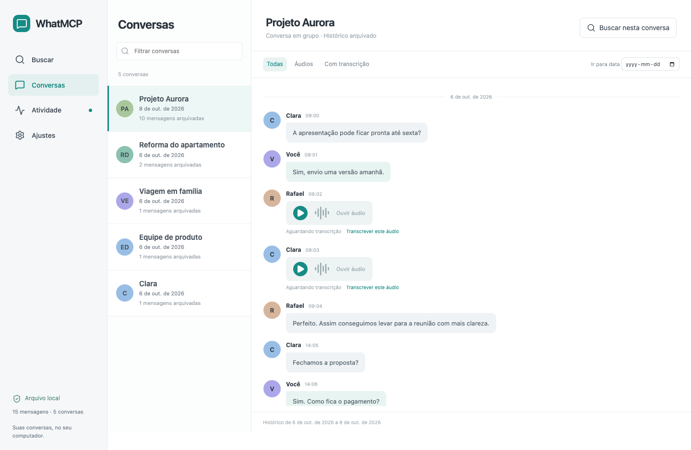
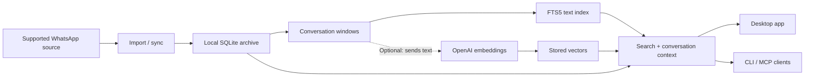

# WhatMCP

A desktop app and MCP server for browsing, searching, and preserving your WhatsApp history in a local archive.

Find a conversation by a phrase, a person, or a topic. Read the surrounding messages,
listen to archived audio, and give an MCP client access to the same history.
The archive lives outside the application and keeps messages already imported,
even when they disappear from the source database.

[Quick start](#quick-start) · [Documentation](#documentation) · [Desktop builds](https://github.com/lucasfeijo/whatmcp/actions/workflows/desktop-build.yml) · [Changelog](CHANGELOG.md)



<sub>The desktop UI is currently in Portuguese. This screenshot uses synthetic demonstration data.</sub>

## What you can do

- **Find past conversations.** Search by text, meaning, or both; narrow results by
  conversation, sender, date, or message type, then open the surrounding context.
- **Browse your history.** Navigate conversations, jump to a date, play available
  audio, and read or request transcripts.
- **Manage processing.** Start sync, transcription, and embedding jobs; see pending
  audio, missing media, and unembedded segments; follow progress, cancel, or retry.
- **Set up through the app.** Try the demo, create an app-owned archive, or select
  an existing profile. Change supported configuration fields in Settings.
- **Connect your tools.** Use the CLI or an MCP client to search messages, find
  people, read threads, and review archive coverage.

Text search works without a provider key. Real semantic search sends conversation
windows and search queries to OpenAI. Optional cloud transcription sends audio;
Apple and local Whisper transcription process audio on your computer.

## Quick start

### Desktop app

Download an installer artifact from a successful run of
[Desktop installers](https://github.com/lucasfeijo/whatmcp/actions/workflows/desktop-build.yml):
macOS ARM64 `.dmg` or Windows x64 `.exe`. GitHub requires sign-in to download
workflow artifacts. The app includes Node and its backend; end users do not need
Node, Rust, or Xcode.

On first launch, choose **Explore the demo** or **Configure my WhatsApp**. The
wizard selects an archive, explains source access, saves optional search/audio
settings, and offers a first sync. Demo mode keeps a visible link back to setup.

The app uses manual sync and does not install a LaunchAgent or Windows task.
You do not need `npm run setup` for this flow. Existing CLI schedulers remain
independent. Builds have no Developer ID/notarization or Windows Authenticode
signature; OS installation prompts and live source access still need platform
validation. See the [desktop guide](desktop/README.md) for requirements and limits.

### Run the demo from source

Use **Node.js 22.23.2**, the version used in CI. No API key, WhatsApp installation,
or native build is needed for the browser demo. These commands use a POSIX shell;
Windows users can run them in Git Bash.

```sh
git clone https://github.com/lucasfeijo/whatmcp.git
cd whatmcp
npm ci
npm ci --prefix desktop
```

Start the synthetic backend:

```sh
WHATMCP_HOME="$PWD/.ci-sandbox/demo" WHATMCP_DESKTOP_MODE=demo OPENAI_API_KEY='' \
  node --experimental-sqlite --experimental-strip-types --no-warnings src/desktop/preview.ts
```

In another terminal, from the same checkout:

```sh
npm run dev --prefix desktop
```

Open [localhost:1420](http://127.0.0.1:1420) and choose the demo. Its messages,
semantic vectors, transcription, and sync are synthetic. The preview uses only
the demo profile, even when navigating the wizard; it cannot open your real archive
or grant OS permissions. Stop both processes with Ctrl+C when finished.

## Usage

In the desktop app, **Buscar** searches the archive, **Conversas** opens threads,
**Atividade** manages jobs and backlogs, and **Ajustes** edits settings or reopens
the guided setup.

With a configured CLI archive, search for a phrase or list conversations:

```sh
npm run wa -- search "invoice" --mode=bm25
npm run wa -- search "payment arrangements" --chat="Project" --mode=hybrid
npm run wa -- chats
npm run wa -- conversation "thread-id-from-chats"
```

Keyword search needs no API key. Hybrid and vector search require embeddings and
a configured OpenAI key. CLI commands default to `~/.whatmcp`; set `WHATMCP_HOME`
to the selected desktop profile when using the same archive.

For an MCP client, launch the stdio server with `npm run serve` or configure the
Node entry point in the client. Start with `search_messages`, then use
`get_conversation` to read a hit in context. `list_messages_since` provides a
chronological, paginated feed without relevance ranking or embeddings.
See [CLI and MCP usage](docs/USAGE.md) for setup, client configuration, all nine
tools, recurring reviews, scheduling, and backups.

## How it works

WhatMCP reads a supported source into its own SQLite archive. Consecutive messages
in each chat become conversation windows, preserving the context that a short
message such as “yes” lacks on its own. Text search uses SQLite FTS5; optional
embeddings add semantic search, with the rankings combined for hybrid results.



The desktop shell is **React + Tauri 2**, backed by bundled **Node 22 and SQLite**.
Its production backend uses private stdin/stdout through allowlisted Rust commands;
opening the app starts no HTTP or MCP listener. CLI MCP transports are separate:
stdio by default, or opt-in Streamable HTTP with authentication.

Imports upsert stable message IDs rather than replacing the archive. Changed
conversation windows get new content hashes; embedding work resumes from what is
missing. Search exposes strong/weak match labels so similarity is not mistaken for
evidence. See [architecture and data guarantees](docs/ARCHITECTURE.md) for the
retrieval, persistence, and security decisions.

## Configuration

The selected profile holds `config.json`, `archive.db`, media, and job history.
Desktop profiles live under the platform's application data directory; the CLI
defaults to `~/.whatmcp`. Selecting a legacy profile is explicit and does not copy
or migrate it. Jobs and Settings then write to that selected profile.

| CLI / MCP variable | Purpose |
| --- | --- |
| `WHATMCP_HOME` | Profile directory containing configuration and the default archive |
| `WHATMCP_STORE` | Override the destination archive, or select an existing archive |
| `WHATMCP_CHATSTORAGE` | Override the compatible source SQLite file |
| `OPENAI_API_KEY` | Override the saved provider key for this process |

Environment overrides apply to CLI/MCP processes. The packaged app selects and
remembers its own profile instead of inheriting these overrides. For the CLI,
`npm run wa -- set-key` prompts without echoing the key and saves it in
`config.json`; avoid putting credentials in arguments or MCP client files.

Choose the source instructions that match your data:

- [macOS desktop app and FDA](desktop/README.md#macos-collection-and-fda)
- [Windows Desktop with the external WAren6 adapter](docs/WINDOWS.md)
- [Compatible SQLite file or existing archive](docs/IMPORT.md)
- [Prepared iPhone-backup history](docs/IPHONE.md)
- [Apple, local Whisper, or OpenAI audio transcription](docs/AUDIO.md)

## Privacy and limits

WhatMCP reads WhatsApp; it cannot send messages, react, join, or leave chats.
Sync writes to its own archive. Retrieved messages are untrusted data and are
fenced in MCP responses. The archive is plaintext SQLite: protect the profile
with OS permissions, disk encryption, and consistent backups.

macOS Full Disk Access is a persistent permission granted by the user. The app's
five-minute capture authorization is an application policy; it does not make FDA
temporary. Archive browsing supports macOS 13+; Apple transcription needs macOS
26+. Windows live capture requires a separately installed WAren6 adapter.
FFmpeg/FFprobe and local Whisper/Python/models are external dependencies.

Coverage depends on the available source history and media bytes. File imports
are snapshots; sender names may be unavailable; reply threading is not supported.
Incremental imports preserve archived messages and do not mirror source deletions.
In-app updates remain disabled until a signed update feed is configured.
Native permission attribution, unsigned installation/upgrade behavior, and real
provider integration require platform tests beyond the synthetic demo and CI.

## Development

After the quick-start dependency installation, run checks from the repository root:

```sh
npm test -- --test-concurrency=2 --test-timeout=120000
npm test --prefix desktop
npm run build --prefix desktop
cargo test --locked --manifest-path desktop/src-tauri/Cargo.toml
```

`desktop` build checks TypeScript and builds the Vite frontend. There is no
separate lint script. To build the installable app, use Rust **1.95.0** and the
platform's native build tools; macOS helper compilation needs an **Xcode 26 SDK**:

```sh
npm run prepare:runtime --prefix desktop
npm run tauri --prefix desktop -- build --bundles app,dmg  # macOS
# Windows: use --bundles nsis instead
```

Use disposable HOME, temporary directories, caches, and `WHATMCP_HOME` for tests
and native development. Keep real messages and credentials outside the checkout.
Fixture CI runs on Ubuntu; installer CI produces macOS ARM64 and Windows x64
artifacts. Read [CI workflows](.github/README.md) and the
[desktop build guide](desktop/README.md#build-and-validation) before native builds
or enabling the separately signed updater.

## Project structure

```text
desktop/           React UI, Tauri shell, macOS collector, packaging scripts
src/desktop/       Shared desktop backend, settings, job workers, synthetic demo
src/whatsapp/      macOS / compatible ChatStorage source reader
src/index/         Import, conversation windowing, embeddings, Windows adapter
src/search/        Text/vector retrieval, conversations, people, timeline
src/transcription/ Audio inventory, providers, resumable transcripts
src/mcp/           Tool definitions, stdio/HTTP transports, OAuth, web dashboard
src/db/            SQLite schema and migrations
test/              Synthetic fixtures and regression tests
docs/              Source setup, usage, architecture, and audio guides
```

## Documentation

[Desktop app](desktop/README.md) · [CLI and MCP](docs/USAGE.md) · [Architecture](docs/ARCHITECTURE.md) · [Remote access](docs/REMOTE.md) · [File import](docs/IMPORT.md) · [Windows](docs/WINDOWS.md) · [iPhone history](docs/IPHONE.md) · [Audio](docs/AUDIO.md)

## Contributing and license

Open an [issue](https://github.com/lucasfeijo/whatmcp/issues) or pull request with
the problem, proposed behavior, and relevant validation. Reproduce bugs with
synthetic fixtures; keep private conversations, archives, and credentials out of
reports and tests.

This fork builds on [Pedro Schott's WhatMCP](https://github.com/pedroschott/whatmcp).
Licensed under [MIT](LICENSE).
